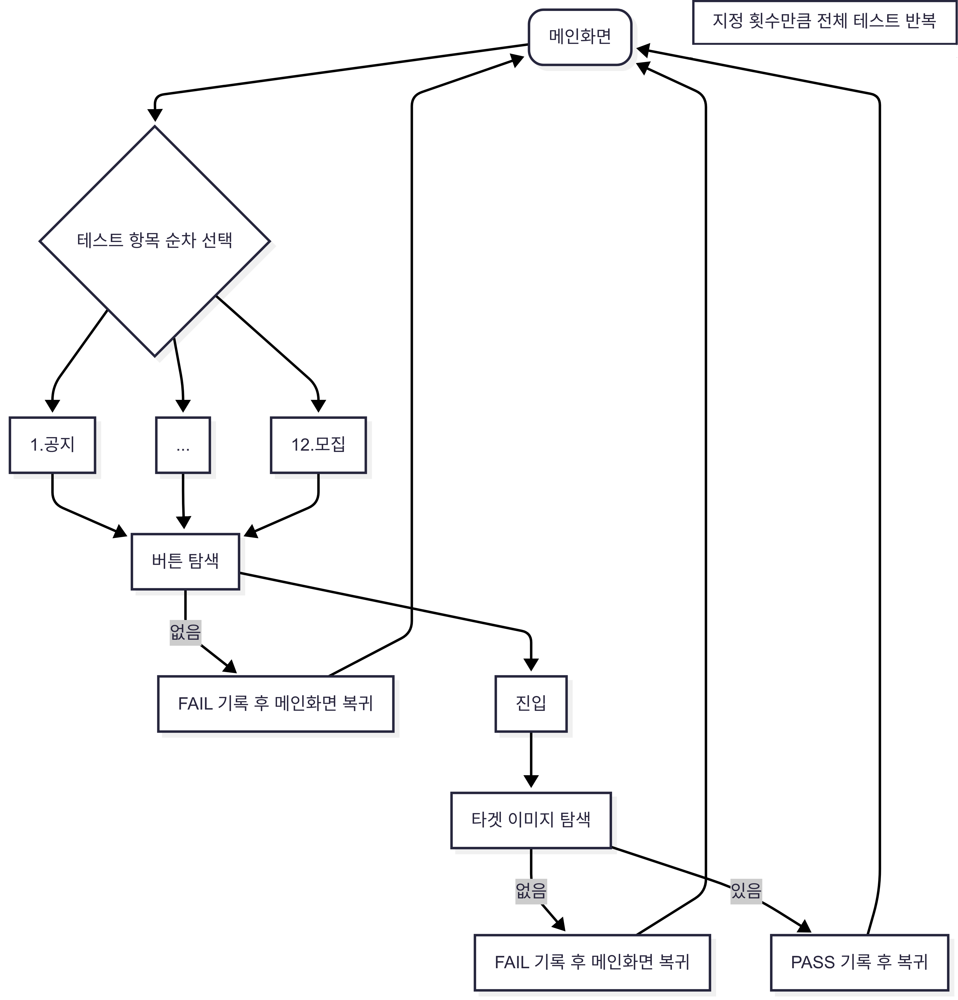

# Blue Archive - 모바일 메인 화면 자동화 테스트

블루 아카이브 Android 버전에서, 메인 화면의 각 기능 버튼들이 정상적으로 동작하는지를 자동으로 테스트하는 AirtestIDE 기반의 자동화 테스트 스크립트입니다.

---
### 📌 테스트 시나리오 흐름도



---

## 📌 주요 기능

- ▶️ 메인 화면의 버튼을 순차적으로 클릭하여 각 기능 진입 테스트
- 🔄 진입 후 닫기 버튼을 눌러 메인 화면 복귀
- 🔁 반복 루틴을 통해 테스트 전체 반복 가능
- 🔄 테스트 완료 후 테스트 로그 및 결과를 txt 파일로 저장

---

## 🚀 사용 기술

- `Airtest` (Android UI 자동화 도구)
- `Python` (스크립트 기반 테스트 흐름 제어)

---

## 🖥️ 실행 방법

### ▶️ Airtest IDE 사용

1. AirtestIDE 실행  
2. Android 기기 USB 연결 → `adb devices`로 인식 확인  
3. `blue_main_mobile.air` 프로젝트 열기  
4. ▶ Run Script 버튼 클릭

---


> 💡 `config.json` 과 이미지 디렉토리가 동일 디렉토리에 있어야 합니다.

---

## 📹 시연 영상 및 테스트 결과

## 👉 시연 영상 보기

- [모바일 메인 화면 테스트 자동화 시연(PC화면)](https://youtu.be/0kT3ABO_-9k)
- [모바일 메인 화면 테스트 자동화 시연(모바일 + PC화면)](https://youtu.be/DLjhIx1R8Rc)

👉 [테스트 설계 및 결과 보기 (Google Sheet)](https://docs.google.com/spreadsheets/d/1RJwQvNWn9rVNjy3hYpxLwXlS4RYEvjnUWjgHTlPDYW8/edit?usp=sharing)

---

## 📂 디렉토리 구조 예시
```
blue_archive_main_mobile/
├── blue_main_mobile.py # 메인 테스트 스크립트
├── config.json # 테스트 설정 파일
├── test_cases.json # 테스트 항목 정의 파일
├── test_log.txt # 실행 로그
├── test_results.txt # 테스트 결과 요약
├── images/ # 버튼 이미지 리소스
│ ├── notice_button.png
│ ├── momo_button.png
│ ├── ...
├── flowchart/             #전체 테스트 흐름도 저장 폴더

```

---

## 🙋‍♂️ 기타

- Airtest의 이미지 인식 방식을 사용하여 버튼 위치를 식별하고 클릭합니다.
- 공지/카페/모모톡/스케쥴/임무 등 다양한 기능 버튼에 대해 자동화 루틴이 구성되어 있습니다.
- 스크립트 내 변수 수정으로 원하는 시점부터 테스트를 시작할 수 있습니다.
- 테스트 설정을 config.json으로 관리합니다
- 테스트 항목 정의를 test_cases.json 을 통해 수행합니다.